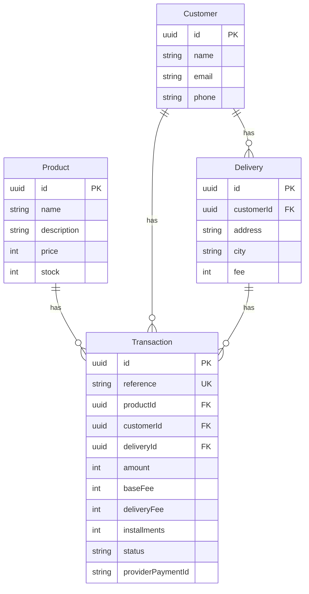

# JDMG Checkout App

Aplicación fullstack de checkout para comprar un producto con tarjeta de crédito: catálogo con stock, captura de datos de pago y entrega, resumen, resultado de la transacción y actualización de inventario.

## Demo (AWS)

| Recurso | URL |
|--------|-----|
| Frontend (CloudFront + S3) | https://d3kyqi9uzkfzsl.cloudfront.net |
| Backend API (HTTPS vía CloudFront → Elastic Beanstalk) | https://d331q1et3v146i.cloudfront.net |
| Health | https://d331q1et3v146i.cloudfront.net/ |
| Products | https://d331q1et3v146i.cloudfront.net/products |

> El frontend consume la API solo por **HTTPS** (sin mixed content).

## Stack

| Capa | Tecnología |
|------|------------|
| Frontend | React (Vite) + TypeScript, Redux Toolkit, redux-persist, Ant Design, React Router |
| Backend | NestJS + TypeScript, arquitectura hexagonal (Ports & Adapters), ROP con `neverthrow` |
| Base de datos | PostgreSQL (Neon) + Prisma |
| Tests | Backend: Jest (>80%). Frontend: Vitest + Testing Library (>80%) |
| Deploy | Frontend: S3 + CloudFront. API: Docker en Elastic Beanstalk + CloudFront HTTPS. CI/CD: GitHub Actions desde `main` |
| Seguridad | Helmet, CORS explícito, ValidationPipe, rate limiting (Throttler), tokens de tarjeta solo en cliente |

## Flujo de negocio (5 pasos)

1. **Product page** — catálogo con nombre, descripción, precio y stock; botón de pago con tarjeta.
2. **Credit card + delivery** — modal con datos de tarjeta (fake válidos), cuotas, cliente y dirección.
3. **Summary** — backdrop con monto del producto + base fee + delivery fee y botón pagar.
4. **Result** — estado final (`APPROVED`, `DECLINED`, `ERROR`, etc.).
5. **Product page** — regreso a la tienda con stock actualizado.

El progreso del checkout se recupera tras un refresh gracias a **Redux + redux-persist (localStorage)**.

La tarjeta **nunca** viaja al backend: el frontend tokeniza en sandbox y envía solo `cardToken` + tokens de aceptación.

## Arquitectura backend

```
backend/src/modules/
  products/
    domain/           # entidades + puertos
    application/      # GetProductsUseCase (ROP)
    infrastructure/   # HTTP + Prisma
  transactions/
    domain/           # Transaction, PaymentGateway port
    application/      # CreateTransactionUseCase (ROP)
    infrastructure/
      http/           # controllers + DTO validation
      persistence/    # Prisma adapters
      payment/        # adapter de pasarela sandbox
```

**Create transaction (resumen):**

1. Valida producto y stock.
2. Calcula `amount = price + BASE_FEE (3000) + deliveryFee (default 8000)`.
3. Persiste `Customer`, `Delivery` y `Transaction` en `PENDING`.
4. Firma de integridad en backend y cobro en sandbox.
5. Polling del resultado.
6. Actualiza status; si `APPROVED`, decrementa stock.

## Modelo de datos



| Entidad | Rol |
|---------|-----|
| `Product` | Catálogo y stock |
| `Customer` | Datos del comprador |
| `Delivery` | Dirección y fee de envío |
| `Transaction` | Pago (`PENDING` → resultado final) + reference única |

Precios y fees están en **centavos/pesos enteros** (sin decimales).

## API

| Método | Ruta | Descripción |
|--------|------|-------------|
| `GET` | `/` | Health |
| `GET` | `/products` | Lista productos (seed) |
| `POST` | `/transactions` | Crea y procesa el pago |
| `GET` | `/transactions/:id` | Consulta transacción |

### `POST /transactions` (body)

```json
{
  "productId": "uuid",
  "customer": {
    "name": "Juan Perez",
    "email": "juan@example.com",
    "phone": "3001234567"
  },
  "delivery": {
    "address": "Calle 123 #45-67",
    "city": "Bogota",
    "fee": 5000
  },
  "cardToken": "<token sandbox>",
  "acceptanceToken": "<acceptance_token>",
  "acceptPersonalAuth": "<accept_personal_auth>",
  "installments": 1
}
```

`installments` opcional: `1 | 3 | 6 | 12`.  
`phone` debe tener exactamente 10 dígitos.

## Postman Collection (pública)

Importa desde el repo (gratis, sin workspace de pago):

- Colección: [`postman/JDMG-Checkout-API.postman_collection.json`](./postman/JDMG-Checkout-API.postman_collection.json)
- Environment Local: [`postman/Local.postman_environment.json`](./postman/Local.postman_environment.json)
- Environment Production: [`postman/Production.postman_environment.json`](./postman/Production.postman_environment.json)

Carpeta: https://github.com/Galindo1327/JDMG-Checkout-App/tree/main/postman

También hay una colección Bruno en [`bruno/`](./bruno/) (opcional).

## Unit tests y coverage

Objetivo del PDF: **> 80%** en frontend y backend.

| Proyecto | Runner | Tests | Coverage (lines) |
|----------|--------|-------|------------------|
| Backend | Jest | 33 passed | **~95%** |
| Frontend | Vitest | 49 passed | **~92%** |

```bash
# Backend
cd backend
npm test
npm run test:cov

# Frontend
cd frontend
npm test
npm run test:cov
```

## Cómo correr en local

### Requisitos

- Node.js 20+
- PostgreSQL (o Neon) con `DATABASE_URL`
- Llaves de sandbox del proveedor de pagos (pública en front; privada + integrity solo en backend)

### Backend

```bash
cd backend
cp .env.example .env
# edita DATABASE_URL, CORS_ORIGINS, llaves sandbox
npm install
npx prisma migrate dev
npx prisma db seed
npm run start:dev
```

API por defecto: `http://localhost:3000` (o el `PORT` de tu `.env`).

### Frontend

```bash
cd frontend
cp .env.example .env
# VITE_API_URL=http://localhost:3000
# VITE_PAYMENT_PROVIDER_PUBLIC_KEY=...
# VITE_PAYMENT_PROVIDER_API_URL=...
npm install
npm run dev
```

App: `http://localhost:5173`

### Variables importantes

**Backend (`.env`)**

| Variable | Uso |
|----------|-----|
| `DATABASE_URL` | PostgreSQL |
| `CORS_ORIGINS` | Orígenes del front (coma-separados) |
| `PORT` | Puerto HTTP |
| `PAYMENT_PROVIDER_API_URL` | URL sandbox del proveedor |
| `PAYMENT_PROVIDER_PUBLIC_KEY` | Llave pública |
| `PAYMENT_PROVIDER_PRIVATE_KEY` | Llave privada (solo backend) |
| `PAYMENT_PROVIDER_INTEGRITY_KEY` | Firma de integridad (solo backend) |

**Frontend (`.env`)**

| Variable | Uso |
|----------|-----|
| `VITE_API_URL` | Base URL del backend |
| `VITE_PAYMENT_PROVIDER_PUBLIC_KEY` | Solo llave pública |
| `VITE_PAYMENT_PROVIDER_API_URL` | API sandbox para tokenización / merchants |

## Deploy (resumen)

- **Frontend:** build Vite → bucket S3 → distribución CloudFront (HTTPS).
- **API:** imagen Docker → Elastic Beanstalk (Amazon Linux 2023) → CloudFront delante para HTTPS hacia el SPA.
- **DB:** PostgreSQL gestionado (Neon).
- CORS de producción apunta al origen CloudFront del front.
- **CI/CD:** GitHub Actions despliega automáticamente desde la rama **`main`**.

### GitHub Actions (rama `main`)

| Workflow | Cuándo corre | Qué hace |
|----------|--------------|----------|
| [`deploy-frontend.yml`](./.github/workflows/deploy-frontend.yml) | Push a `main` con cambios en `frontend/**` (o manual) | `npm run build` → sync S3 → invalidación CloudFront |
| [`deploy-backend.yml`](./.github/workflows/deploy-backend.yml) | Push a `main` con cambios en `backend/**` (o manual) | Build imagen en GitHub Actions → ECR → Elastic Beanstalk |

Secrets del repo (Settings → Secrets and variables → Actions) ya configurados para este proyecto:

`AWS_ACCESS_KEY_ID`, `AWS_SECRET_ACCESS_KEY`, `AWS_REGION`, `S3_BUCKET`, `CLOUDFRONT_DISTRIBUTION_ID`, `VITE_API_URL`, `VITE_PAYMENT_PROVIDER_PUBLIC_KEY`, `VITE_PAYMENT_PROVIDER_API_URL`, `EB_APPLICATION_NAME`, `EB_ENVIRONMENT_NAME`, `EB_S3_BUCKET`, `ECR_REPOSITORY`.

Flujo de trabajo recomendado: desarrollar en feature/`test` → PR a `main` → merge → deploy automático.

## Seguridad (bonus)

- HTTPS en front y API (CloudFront).
- Helmet (security headers).
- CORS con allowlist explícita (no `*` en production).
- Validación de DTOs (`whitelist` + `forbidNonWhitelisted`).
- Rate limiting con Throttler.
- Sin número de tarjeta en backend ni en logs de aplicación.
- Secrets fuera del repo (`.env` / variables de entorno del cloud).

## Estructura del monorepo

```
JDMG-Checkout-App/
├── .github/workflows/  # CI/CD (deploy front + API desde main)
├── backend/            # NestJS API
├── frontend/           # React SPA
├── postman/            # Colección + environments Postman
├── bruno/              # Colección Bruno (opcional)
└── README.md
```

## Autor

Juan David Mosquera Galindo — [GitHub](https://github.com/Galindo1327) · [LinkedIn](https://www.linkedin.com/in/galindo1327/)
